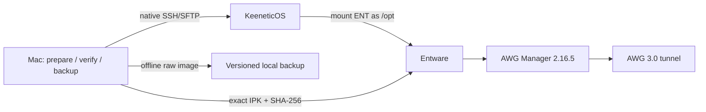

# Keenetic AWG 3 bootstrap design

## Цель

Подготовить воспроизводимый Mac-only комплект для установки Entware и AWG
Manager с AWG 3.0 на текущий Netcraze Hopper 4G+ и на второе аналогичное
устройство. После первичной настройки роутер работает автономно; Mac нужен
только для подготовки, обновления, резервного копирования и восстановления.

Решение относится к категории `custom-only`: оно описывает личные устройства и
не меняет публичную маршрутизацию Shadowrocket.

## Исходные условия и ограничения

- Текущий роутер: Netcraze Hopper 4G+ NC-2312, KeeneticOS 5.1 Beta 1,
  `aarch64-k3.10`, LAN `192.168.1.1`.
- На Mac уже установлен Homebrew `e2fsprogs` 1.47.3. Windows, Linux VM,
  FUSE-драйвер и монтирование ext4 в macOS не требуются.
- Старая 4 ГБ USB-флешка получила тяжёлое повреждение ext4. Её можно оставить
  только как временный или аварийный носитель, но не как основу новой установки.
- Обычная установка не должна перезагружать роутер. Если для отсутствующего
  компонента KeeneticOS потребуется перезагрузка, сценарий останавливается и
  запрашивает отдельное подтверждение пользователя.
- Секреты, приватные ключи и пароли не попадают в Git, golden image или логи.
- Временный пароль администратора после настройки меняется пользователем.
  Временно включённый нативный SFTP отключается после проверки Entware SSH.

## Носитель и разметка

Базовый вариант для обоих устройств:

- Samsung PRO Endurance microSDHC 32 ГБ (`MB-MJ32KA`);
- компактный USB-A кардридер Transcend RDF5 или аналогичный надёжный reader;
- таблица разделов MBR;
- первый primary-раздел начинается с сектора 2048;
- размер раздела — 8 GiB;
- файловая система ext4 с меткой `ENT`;
- оставшееся пространство намеренно не размечается.

8 GiB с большим запасом покрывает Entware, AWG Manager, конфигурации и логи, но
ограничивает размер полного образа, длительность `fsck` и область возможного
повреждения. Неразмеченный остаток не считается гарантированным
over-provisioning уровня SSD: его польза здесь прежде всего в компактности и
простоте обслуживания образа.

Mac выполняет разметку штатными `diskutil`/`fdisk`, а ext4 создаётся
`mkfs.ext4` из Homebrew e2fsprogs. Работа ведётся с размонтированным raw device;
монтировать ext4 в macOS не нужно.

## Защита от выбора неправильного диска

Подготовка и восстановление карты являются единственными разрушительными
операциями. Скрипт принимает только явный `/dev/diskN` и перед записью обязан:

1. получить свойства через `diskutil info -plist`;
2. подтвердить `Internal: No`, `Removable Media: Yes` и ожидаемый диапазон
   ёмкости;
3. показать производитель, модель, размер, текущие разделы и итоговую разметку;
4. отказаться от whole disk с системными APFS-контейнерами или неожиданными
   смонтированными томами;
5. потребовать повторный ввод точного идентификатора диска;
6. после размонтирования заново проверить, что identifier и hardware metadata
   не изменились.

Скрипт не принимает `~`, glob, переменную окружения вместо device или
автоматически выбранный «последний подключённый диск».

## Архитектура комплекта

Планируемый контур размещается в `tools/keenetic-awg3/`:

```text
tools/keenetic-awg3/
├── README.md
├── manifests/
│   └── packages.lock
├── profiles/
│   └── router.example.env
├── scripts/
│   ├── inspect-card.sh
│   ├── prepare-card.sh
│   ├── backup-card.sh
│   ├── restore-card.sh
│   ├── preflight-router.sh
│   ├── bootstrap-entware.sh
│   ├── install-awg-manager.sh
│   └── verify-router.sh
└── tests/
    └── test-safety.sh
```

`packages.lock` фиксирует URL, архитектуру, точную версию, размер и SHA-256
каждого скачиваемого артефакта. Профиль содержит только несекретные параметры:
имя устройства, LAN-адрес, модель и ожидаемую архитектуру. Реальные локальные
профили, скачанные IPK, образы, конфигурации туннелей и секреты хранятся вне Git
в каталоге, явно добавленном в `.gitignore`.

Скрипты должны быть небольшими и композиционными: каждый сначала выполняет
read-only preflight, затем показывает изменение, и лишь потом делает одну
группу действий. Общий «магический» скрипт, который одновременно форматирует
карту, меняет компоненты роутера и поднимает туннель, не создаётся.

## Поток данных



Mac готовит пустую ext4-карту офлайн. После подключения к роутеру файлы
передаются через нативный SSH/SFTP. После запуска Entware управление переходит
на отдельный root SSH с ключом в `/opt/root/.ssh/authorized_keys`; парольная
аутентификация для автоматизации не используется.

## Версии и карантин зависимостей

Никакие `latest`, плавающие feed URL или удалённые install scripts не
исполняются. Процесс добавления или обновления пакета разделён на discovery и
execution:

1. скачать точный артефакт во временный каталог без установки;
2. сохранить SHA-256 и metadata;
3. распаковать IPK, проверить `control`, список файлов и maintainer scripts;
4. проверить архитектуру бинарников и kernel modules;
5. закрепить одобренные данные в `packages.lock`;
6. устанавливать только при полном совпадении lock и скачанного файла.

Проверенный кандидат на 3 августа 2026 года:

- `awg-manager_2.16.5_aarch64-3.10-kn.ipk`;
- SHA-256
  `1b841747a85dda101e5d9be0b647c84275f354fc51b41d71b26e684f44f19b12`;
- зависимости: `iptables`, `ip-full`, `wireguard-tools`, `conntrack`;
- встроенный AWG module bundle: `3.0.20260731-04`;
- web UI по умолчанию: TCP `2222`.

Пакет содержит статические AArch64-бинарники, NDMS hooks, init script и kernel
modules. Его `postinst` создаёт каталоги, удаляет legacy-файлы и немедленно
запускает сервис. Поэтому установка допускается только после preflight и
резервной копии. Опубликованный repository index и metadata feed могут
обновляться несинхронно; источником истины служит локальный lock с хешем, а не
номер версии из `Packages`.

Entware bootstrap и его прямые зависимости проходят тот же аудит. Их точные
версии фиксируются на этапе реализации после отдельного просмотра metadata;
до этого автоматическая установка Entware не разрешена.

## Последовательность установки

### 1. Подготовка карты на Mac

- определить карту и пройти safety checks;
- создать MBR и 8 GiB-раздел;
- создать ext4 `ENT`;
- выполнить read-only `e2fsck`;
- сохранить layout, UUID, версии инструментов и контрольный отчёт;
- безопасно извлечь карту.

### 2. Подключение и Entware

- подключить карту к роутеру и подтвердить, что Keenetic видит ext4;
- проверить модель, firmware, архитектуру, свободное место и `/opt`;
- сделать резервную копию существующей конфигурации, если она есть;
- установить только закреплённый Entware bootstrap;
- восстановить необходимые пакеты и root SSH;
- добавить публичный ключ, проверить вход отдельной SSH-сессией;
- не закрывать аварийную admin-сессию до успешной проверки.

Повторный запуск не должен перетирать рабочий `/opt`, ключи или настройки:
скрипт сравнивает фактическое состояние с manifest и либо продолжает, либо
останавливается с точным конфликтом.

### 3. AWG Manager и AWG 3.0

- проверить зависимости и свободное место;
- сохранить `/opt/etc/awg-manager`, init script и список установленных пакетов;
- сверить IPK с lock;
- показать пользователю, что `postinst` запустит сервис;
- установить пакет через локальный `opkg`;
- проверить процесс, PID, порт 2222, журнал, NDMS hooks и выбранный kernel
  module;
- создать или импортировать туннель через UI/API только после проверки сервиса;
- проверить handshake, маршрут и доступ в интернет без изменения остальных
  политик роутера.

AWG-конфигурация привязана к конкретному устройству и не входит в golden image.
Для второго роутера создаётся отдельный локальный профиль и отдельные ключи.

## Резервное копирование и восстановление

Предусмотрены два разных артефакта:

- диагностический снимок ext4 metadata через `e2image` и отчёт `e2fsck`;
- полный сжатый образ 8 GiB-раздела через raw `dd` с SHA-256, пригодный для
  побайтового восстановления.

Golden image создаётся после чистой проверенной установки Entware и базовых
пакетов, но до добавления device secrets и AWG-туннелей. Он сопровождается
manifest: размер раздела, ext4 UUID, список пакетов, их версии/хеши, версия
KeeneticOS и дата проверки.

Отдельный per-device backup содержит конфигурацию AWG Manager, список пакетов и
несекретный router report. Приватные ключи хранятся в локальном зашифрованном
хранилище пользователя, не внутри репозитория. Восстановление полного образа
допускается только на раздел не меньше исходного и проходит те же проверки
device identity, что и форматирование.

Регламент обслуживания:

- перед обновлением пакетов — config backup и проверка файловой системы;
- после некорректного отключения — сначала `e2fsck -fn`, запись только отдельной
  подтверждённой командой;
- периодически — сверка package manifest, свободного места и ошибок kernel log;
- golden image остаётся неизменным; обновлённая база получает новый versioned
  image, а предыдущая сохраняется для отката.

## Обработка ошибок и откат

- Ошибка до `opkg install`: роутер не изменяется, временные файлы удаляются.
- Ошибка `postinst`: сервис останавливается, сохраняются лог и фактический
  package state; автоматическое удаление не выполняется, потому что `prerm`
  пакета запускает собственный cleanup туннелей.
- Ошибка kernel module: туннель не создаётся; собираются модель, firmware,
  `uname`, module hash и `dmesg`. Подмена `.ko` с похожей модели запрещена.
- Потеря root SSH: остаётся проверенная admin-сессия и нативный доступ; SFTP
  отключается только после восстановления root-доступа.
- Повреждение ext4: карта безопасно извлекается, создаётся raw backup текущего
  состояния, затем выполняется диагностический и отдельно подтверждённый repair
  flow. При неуспехе разворачивается последний проверенный golden image и
  per-device config backup.

Сценарии не перезагружают роутер, не удаляют интерфейсы и не меняют системные
компоненты KeeneticOS без отдельного явного действия пользователя.

## Проверка

Автоматические тесты будущей реализации работают только с фикстурами и
временными файлами; они никогда не обращаются к реальному `/dev/diskN` или
роутеру. Они проверяют:

- отказ для internal/non-removable/system disk и несовпадающей модели;
- обязательность повторного ввода device identifier;
- корректный расчёт 8 GiB-раздела с началом в секторе 2048;
- отказ при несовпадении SHA-256, версии или архитектуры пакета;
- отсутствие секретов в логах и tracked-файлах;
- идемпотентность preflight/bootstrap decisions;
- остановку перед reboot, package cleanup и другими отдельными gates;
- shell syntax и ожидаемые команды через mock `diskutil`, `ssh`, `scp` и
  `opkg`.

Для изменений запускается полный обязательный набор репозитория:

```bash
python3 -m unittest discover -s tests -v
python3 -m compileall -q scripts tests
```

Ручная приёмка на каждом устройстве:

1. `e2fsck -fn` чист на новой карте.
2. После извлечения/подключения `/opt` возвращается без ошибок ext4 в `dmesg`.
3. Root SSH по ключу выдерживает повторное подключение.
4. AWG Manager 2.16.5 запущен и защищён аутентификацией; порт 2222 недоступен
   из WAN.
5. AWG 3.0-туннель устанавливает handshake и восстанавливается после мягкого
   restart сервиса.
6. Backup восстанавливается на запасную карту и проходит повторную проверку.
7. Нативный SFTP отключён, временный admin-пароль сменён.

## Критерии готовности

Работа завершена, когда:

1. Одна команда безопасно подготавливает явно выбранную карту с утверждённой
   разметкой, но не может выбрать системный диск автоматически.
2. Entware и AWG Manager устанавливаются только из проверенных pinned artifacts.
3. Текущий и второй роутер используют разные локальные профили и ключи.
4. Повторный запуск не повреждает рабочую установку.
5. Полный golden image и per-device backup реально восстановлены на тестовую
   карту, а не только созданы.
6. AWG 3.0 работает после service restart без обязательной перезагрузки роутера.
7. README позволяет повторить подготовку, установку, обновление, диагностику и
   аварийное восстановление только с Mac.
